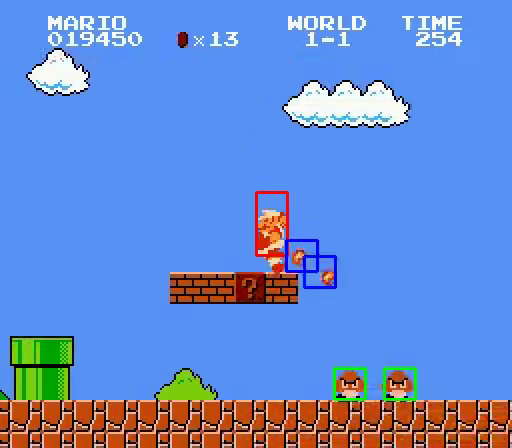

# Tracking Mario

This program uses the Tensorflow framework to track the position of each character in the game's screen with an R-CNN-based algorithm.



## Required library

The tesnorflow 1.12.0 C++ library and the OpenCV 3.4 library are required to compile the program.

## How to compile

```
cd TrackingMario
mkdir build
cd build
cmake ../
make
```

## How to perform

./TrackingMario ../model/RCNN ../video/Mario.mp4

